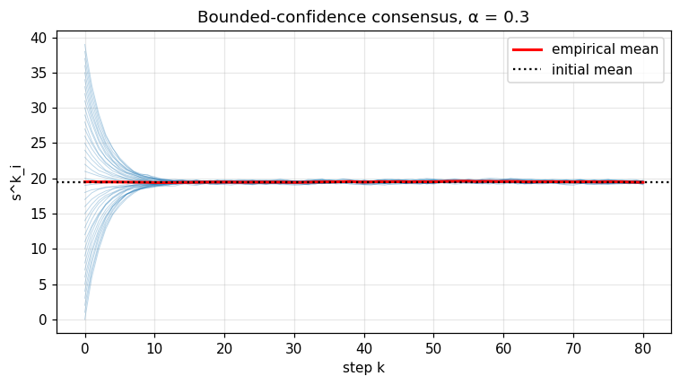
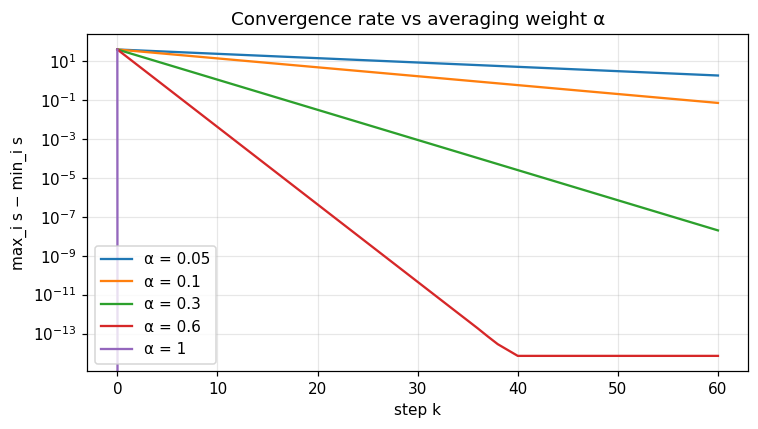

Agent-based — bounded-confidence consensus
==========================================

Generic symmetric *interacting-agent* simulator implementing the linear bounded-confidence
update rule

.. math::

   s^{k+1}_i \;=\; (1 - \alpha)\, s^k_i \;+\; \alpha\, \bar s^k \;+\; \xi^k_i,
   \qquad \bar s^k \;=\; \frac1N \sum_{j=1}^N s^k_j,
   \qquad \xi^k_i \sim \mathcal{N}(0, \sigma^2),

with $\alpha \in (0, 1]$ the *averaging weight* and $\sigma$ the noise scale.  This is the
DeGroot–Friedkin–Johnsen baseline of opinion dynamics, and the *complete-graph* limit of the
Hegselmann–Krause and Vicsek flocking models.

Mathematical background
-----------------------

**Mean conservation.**  Averaging the update over $i$ gives
$\bar s^{k+1} = \bar s^k + \bar\xi^k$ with $\mathbb{E}[\bar\xi^k] = 0$, so the empirical mean
is a *martingale* and is exactly preserved in expectation:

.. math::

   \mathbb{E}[\bar s^k] \;=\; \bar s^0 \quad \text{for all } k \ge 0.

In the noiseless case $\sigma = 0$ the mean is preserved *path-by-path*.

**Geometric contraction of the spread.**  Define the deviation $d^k_i := s^k_i - \bar s^k$.
The update implies

.. math::

   d^{k+1}_i \;=\; (1 - \alpha)\, d^k_i \;+\; \bigl(\xi^k_i - \bar\xi^k\bigr) ,

so in the absence of noise $\| d^k \|_\infty \le (1 - \alpha)^k \| d^0 \|_\infty$ — the spread
*contracts geometrically* with rate $1 - \alpha$.  The companion notebook plots
$\max_i s^k_i - \min_i s^k_i$ on a log scale across $\alpha \in \{0.05, \dots, 1\}$ and
recovers exactly this slope.

**Stationary variance with noise.**  Treating the deviation as an AR(1) process with input
variance $\sigma^2 (1 - 1/N)$, the steady-state variance of any single agent's deviation is

.. math::

   \mathrm{Var}_\infty(d_i) \;=\; \frac{\sigma^2 (1 - 1/N)}{1 - (1 - \alpha)^2}
     \;\xrightarrow[\alpha \to 0]{}\; \frac{\sigma^2}{2\alpha}\,(1 - 1/N).

**Continuous-time limit (linear Vlasov).**  Sending $\alpha = \theta\, \Delta t$,
$\xi^k_i = \sigma \sqrt{\Delta t}\, W^i_k$ and $\Delta t \to 0$ recovers the McKean–Vlasov SDE
$dX^i_t = \theta(\bar X_t - X^i_t)\, dt + \sigma\, dW^i_t$ of :doc:`mckean_vlasov` — the
discrete consensus update is the prototype of mean-field interaction.

**Spectral interpretation.**  On a general weighted graph the update reads
$s^{k+1} = (I - \alpha L)\, s^k + \xi^k$, where $L$ is the normalised Laplacian.  The
complete-graph case shipped here has $L = I - \tfrac1N \mathbf{1}\mathbf{1}^\top$ with
eigenvalue $1$ on the orthogonal complement of $\mathbf{1}$, hence the contraction rate
$1 - \alpha$ above.  Replacing $\mathbf{1}\mathbf{1}^\top / N$ by an arbitrary stochastic
matrix produces the full DeGroot model and is a one-liner extension on the Rust side.

Why it matters
--------------

* **Opinion dynamics & social learning.**  Calibration of polarisation/consensus models
  (Bayesian persuasion, social media echo chambers, voting-system stability).
* **Distributed estimation & federated learning.**  Average-consensus protocols for sensor
  networks, gossip algorithms, federated averaging — all reduce to the same contraction
  argument with explicit convergence rate $1 - \alpha$.
* **Coupled-oscillator physics.**  Linear approximation of the Kuramoto / Vicsek models near
  the synchronised regime; direct comparison with the McKean–Vlasov continuous limit.

.. note::
   📓 **Companion notebook** — `view on GitHub <https://github.com/ThotDjehuty/optimiz-rs/blob/main/examples/notebooks/15_agent_based.ipynb>`_
   · `download .ipynb <https://raw.githubusercontent.com/ThotDjehuty/optimiz-rs/main/examples/notebooks/15_agent_based.ipynb>`_

15 — Agent-based dynamics
=========================

.. code-block:: python

   import numpy as np
   import matplotlib.pyplot as plt
   from optimizr import _core as opt
   plt.rcParams['figure.figsize'] = (7, 4)
   plt.rcParams['figure.dpi'] = 110

.. code-block:: python

   init = np.arange(40.0).tolist()
   init_mean = float(np.mean(init))
   res = opt.consensus_dynamics(init, alpha=0.3, noise_sigma=0.1,
                                 n_steps=80, seed=0)
   n_t = res['n_steps']; n_a = res['n_agents']
   S = np.array(res['states_flat']).reshape(n_t, n_a)
   mean_traj = np.array(res['mean_trajectory'])
   print('initial mean =', init_mean)
   print('final mean   =', mean_traj[-1])
   print('final std    =', float(S[-1].std()))

.. code-block:: python

   fig, ax = plt.subplots()
   for i in range(n_a):
       ax.plot(S[:, i], color='tab:blue', alpha=0.3, lw=0.6)
   ax.plot(mean_traj, color='red', lw=2, label='empirical mean')
   ax.axhline(init_mean, color='k', ls=':', label='initial mean')
   ax.set_xlabel('step k'); ax.set_ylabel('s^k_i'); ax.legend(); ax.grid(alpha=0.3)
   ax.set_title('Bounded-confidence consensus, α = 0.3')
   fig.tight_layout(); plt.show()

.. AUTO-PLOT-BEGIN
.. image:: ../_static/auto/algorithms__agent_based/block_03_fig_01.png
   :align: center
   :width: 80%

.. AUTO-PLOT-END

.. code-block:: python

   fig, ax = plt.subplots()
   for alpha in [0.05, 0.1, 0.3, 0.6, 1.0]:
       r = opt.consensus_dynamics(init, alpha=alpha, noise_sigma=0.0, n_steps=60, seed=0)
       S = np.array(r['states_flat']).reshape(r['n_steps'], r['n_agents'])
       spread = S.max(axis=1) - S.min(axis=1)
       ax.semilogy(spread, label=f'α = {alpha:g}')
   ax.set_xlabel('step k'); ax.set_ylabel('max_i s − min_i s')
   ax.set_title('Convergence rate vs averaging weight α'); ax.legend(); ax.grid(alpha=0.3)
   fig.tight_layout(); plt.show()

.. AUTO-PLOT-BEGIN
.. image:: ../_static/auto/algorithms__agent_based/block_04_fig_01.png
   :align: center
   :width: 80%

.. AUTO-PLOT-END

**Verified:** without noise, the empirical mean is exactly preserved and the spread decays geometrically.

API
---

.. code-block:: rust

   pub fn simulate_agent_based<T>(initial: &[f64], transition: T, cfg: &AgentBasedConfig) -> Result<AgentBasedResult>
   where T: Fn(f64, &[f64], usize) -> f64;

   pub struct AgentBasedConfig { pub n_agents: usize, pub n_steps: usize, pub noise_sigma: f64, pub seed: u64 }
   pub struct AgentBasedResult { pub states: Array2<f64>, pub mean_trajectory: Array1<f64> }
