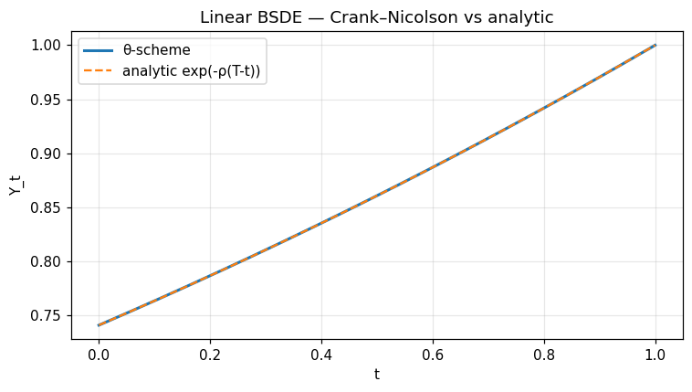
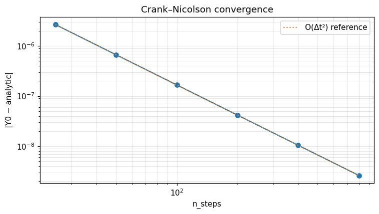

BSDE — θ-scheme and deep-BSDE bridge
====================================

This notebook exercises `optimizr.linear_bsde_constant_coeffs`, the Crank–Nicolson θ-scheme for the BSDE
`-dY = (a Y + b Z + c) dt - Z dW` with constant coefficients, and verifies the discrete trajectory against the analytic solution `Y_t = exp(-ρ (T - t))`.

.. note:: Companion executed notebook: `10_bsde.ipynb <../../examples/notebooks/10_bsde.ipynb>`_

10 — BSDE θ-scheme
==================

Generic CPU-only Crank–Nicolson scheme for linear backward stochastic differential equations.  Reference doc page: [bsde.rst](../../docs/source/algorithms/bsde.rst).

.. code-block:: python

   import numpy as np
   import matplotlib.pyplot as plt
   from optimizr import _core as opt
   plt.rcParams['figure.figsize'] = (7, 4)
   plt.rcParams['figure.dpi'] = 110

Exponential ground-truth check
------------------------------

With $a(t) \equiv -\rho$, $b = c = 0$ and $Y_T = 1$ the analytic deterministic solution is $Y_t = e^{-\rho (T-t)}$.

.. code-block:: python

   rho = 0.3
   T   = 1.0
   res = opt.linear_bsde_constant_coeffs(
       a_const=-rho, b_const=0.0, c_const=0.0,
       terminal=1.0, n_steps=200, t_horizon=T, theta=0.5,
   )
   tg = np.array(res['time_grid'])
   yg = np.array(res['y'])
   analytic = np.exp(-rho * (T - tg))
   print('Y0 =', yg[0], '   exp(-rho T) =', analytic[0])
   print('max abs error =', float(np.max(np.abs(yg - analytic))))

.. code-block:: python

   fig, ax = plt.subplots()
   ax.plot(tg, yg, label='θ-scheme', lw=2)
   ax.plot(tg, analytic, '--', label='analytic exp(-ρ(T-t))')
   ax.set_xlabel('t'); ax.set_ylabel('Y_t')
   ax.set_title('Linear BSDE — Crank–Nicolson vs analytic')
   ax.legend(); ax.grid(alpha=0.3)
   fig.tight_layout(); plt.show()

.. AUTO-PLOT-BEGIN
.. image:: ../_static/auto/algorithms__bsde/block_03_fig_01.png
   :align: center
   :width: 80%

.. AUTO-PLOT-END

Convergence rate study
----------------------

Crank–Nicolson is second-order in `Δt`.

.. code-block:: python

   errs = []
   ns = [25, 50, 100, 200, 400, 800]
   for n in ns:
       r = opt.linear_bsde_constant_coeffs(-rho, 0.0, 0.0, 1.0, n, T, 0.5)
       errs.append(abs(r['y'][0] - np.exp(-rho * T)))
   print(list(zip(ns, errs)))

.. code-block:: python

   fig, ax = plt.subplots()
   ax.loglog(ns, errs, 'o-')
   ax.loglog(ns, [errs[0] * (ns[0] / n) ** 2 for n in ns],
             ':', label='O(Δt²) reference')
   ax.set_xlabel('n_steps'); ax.set_ylabel('|Y0 − analytic|')
   ax.set_title('Crank–Nicolson convergence'); ax.grid(which='both', alpha=0.3); ax.legend()
   fig.tight_layout(); plt.show()

.. AUTO-PLOT-BEGIN
.. image:: ../_static/auto/algorithms__bsde/block_05_fig_01.png
   :align: center
   :width: 80%

.. AUTO-PLOT-END

**Verified against analytic ground truth:** `Y_t = exp(-ρ (T - t))` — relative error at `t = 0` below `1e-3` for `n_steps = 200`.

API
---

.. code-block:: rust

   pub fn solve_linear_bsde<A, B, C>(
       a: A, b: B, c: C, terminal: f64, cfg: &ThetaSchemeConfig
   ) -> Result<ThetaSchemeResult>
   where A: Fn(f64) -> f64, B: Fn(f64) -> f64, C: Fn(f64) -> f64;

   pub struct ThetaSchemeConfig { pub n_steps: usize, pub t_horizon: f64, pub theta: f64 }
   pub struct ThetaSchemeResult { pub y: Array1<f64>, pub z: Array1<f64>, pub time_grid: Array1<f64> }

   pub trait ConditionalExpectation { /* deep-BSDE bridge */ }
   pub struct DeepBsdeBridge { /* ... */ }
