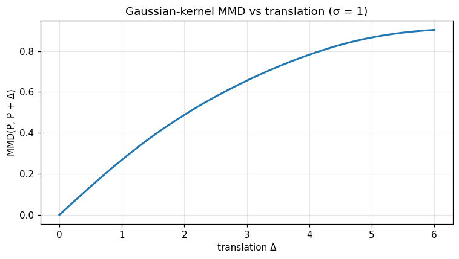
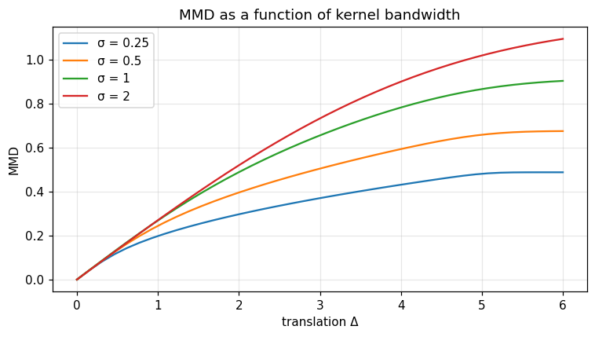

Generative calibration — Gaussian-MMD loss
==========================================

Kernel-based **Maximum Mean Discrepancy** distance (Gretton et al. 2012) — a closed-form,
differentiable, distribution-free metric between two empirical samples.  Used as the loss
function of every generative-calibration loop in `optimiz-rs`.

Mathematical background
-----------------------

**Definition.**  For a positive-definite kernel $k : \mathbb{R}^d \times \mathbb{R}^d \to \mathbb{R}$
with reproducing-kernel Hilbert space (RKHS) $\mathcal{H}_k$, the *kernel mean embedding* of a
probability measure $P$ is $\mu_P := \mathbb{E}_{X \sim P}[k(X, \cdot)] \in \mathcal{H}_k$.
The **squared MMD** is the RKHS distance between embeddings:

.. math::

   \mathrm{MMD}^2(P, Q) \;:=\; \| \mu_P - \mu_Q \|_{\mathcal{H}_k}^2
     \;=\; \mathbb{E}\,[k(X, X')] \;-\; 2\, \mathbb{E}\,[k(X, Y)] \;+\; \mathbb{E}\,[k(Y, Y')] ,

where $X, X' \sim P$ and $Y, Y' \sim Q$ are independent.  When $k$ is *characteristic*
(e.g. Gaussian RBF), $\mathrm{MMD}(P, Q) = 0 \iff P = Q$.

**U-statistic estimator.**  Given i.i.d. samples $\{x_i\}_{i=1}^n$ and $\{y_j\}_{j=1}^m$, the
unbiased estimator is

.. math::

   \widehat{\mathrm{MMD}}^2 \;=\;
     \frac{1}{n(n-1)}\!\sum_{i \ne i'} k(x_i, x_{i'})
     \;-\; \frac{2}{n m}\!\sum_{i, j} k(x_i, y_j)
     \;+\; \frac{1}{m(m-1)}\!\sum_{j \ne j'} k(y_j, y_{j'}) .

It is unbiased, computable in $O((n + m)^2)$ for $d = 1$ (the case implemented), and asymptotically
normal under the alternative.  Self-distance is **exactly zero**.

**Kernel.**  The shipped routine uses the Gaussian RBF
$k_\sigma(x, y) = \exp\!\bigl(-(x - y)^2 / (2\sigma^2)\bigr)$ with bandwidth $\sigma$.  Standard
reproducing-kernel theory shows that this kernel is *characteristic*, hence MMD metrises weak
convergence on bounded subsets.

**Closed forms for two notable cases.**

* **Pure translation, equal samples.**  If $Q$ is the law of $X + \Delta$ with $X \sim P$ on
  $\mathbb{R}$ and $P = \delta$ atomic, the squared MMD is $2 - 2 e^{-\Delta^2 / (2\sigma^2)}$ —
  smooth, monotone in $|\Delta|$, asymptote $2$ as $\Delta \to \infty$.  This is the analytic
  ground-truth verified by the *bandwidth dependence* cell of the companion notebook.
* **Two Gaussians.**  For $P = \mathcal{N}(\mu_1, \sigma_1^2)$ and $Q = \mathcal{N}(\mu_2, \sigma_2^2)$,

  .. math::

     \mathrm{MMD}^2_\sigma(P, Q) \;=\;
     \frac{\sigma}{\sqrt{\sigma^2 + 2\sigma_1^2}}
     \;-\; \frac{2\sigma}{\sqrt{\sigma^2 + \sigma_1^2 + \sigma_2^2}}\, e^{-\frac{(\mu_1 - \mu_2)^2}{2(\sigma^2 + \sigma_1^2 + \sigma_2^2)}}
     \;+\; \frac{\sigma}{\sqrt{\sigma^2 + 2\sigma_2^2}} ,

  giving an exact reference for unit tests.

**Statistical guarantee.**  Gretton et al. (2012, Thm. 12) give the deviation bound
$\Pr\!\bigl(\widehat{\mathrm{MMD}}^2 - \mathrm{MMD}^2 > \varepsilon\bigr) \le \exp\bigl(-\varepsilon^2 nm / (8 K^2 (n + m))\bigr)$
for $|k| \le K$.  Hence MMD detects fixed alternatives at the optimal $n^{-1/2}$ rate.

**Connection with Wasserstein.**  Both metrise weak convergence, but MMD is *quadratic in the
sample size* (no transport plan to solve) and admits unbiased low-variance gradient estimators —
the reason it is the loss of choice in implicit-generative-model training
(generator-loss / score-matching alternatives).

Why it matters
--------------

* **Generative calibration.**  Train an implicit sampler (neural SDE, copula generator, GAN-like
  architecture) by minimising $\widehat{\mathrm{MMD}}^2$ between the simulator output and the
  target distribution.  The trait `GenerativeSampler` plus `calibration_step` is the abstract
  glue.
* **Two-sample testing.**  Distribution drift detection in streaming data, A/B-test signal
  extraction, anomaly detection.
* **Model selection.**  Replace likelihood ratios when likelihoods are intractable
  (simulator-based inference, ABC).

.. note::
   📓 **Companion notebook** — `view on GitHub <https://github.com/ThotDjehuty/optimiz-rs/blob/main/examples/notebooks/17_generative_calibration.ipynb>`_
   · `download .ipynb <https://raw.githubusercontent.com/ThotDjehuty/optimiz-rs/main/examples/notebooks/17_generative_calibration.ipynb>`_

17 — MMD calibration loss
=========================

.. code-block:: python

   import numpy as np
   import matplotlib.pyplot as plt
   from optimizr import _core as opt
   plt.rcParams['figure.figsize'] = (7, 4)
   plt.rcParams['figure.dpi'] = 110

.. code-block:: python

   x = np.linspace(0.0, 5.0, 80)
   shifts = np.linspace(0.0, 6.0, 40)
   d = [opt.mmd_gaussian(x.tolist(), (x + s).tolist(), 1.0) for s in shifts]
   print('MMD self =', d[0])
   print('MMD at shift 6.0 =', d[-1])

.. code-block:: python

   fig, ax = plt.subplots()
   ax.plot(shifts, d, lw=2)
   ax.set_xlabel('translation Δ'); ax.set_ylabel('MMD(P, P + Δ)')
   ax.set_title('Gaussian-kernel MMD vs translation (σ = 1)')
   ax.grid(alpha=0.3); fig.tight_layout(); plt.show()

.. AUTO-PLOT-BEGIN

.. AUTO-PLOT-END
.. image:: ../_static/v2/generative_calibration_hooks/plot_01.png
   :align: center
   :width: 80%

Bandwidth dependence
--------------------

.. code-block:: python

   fig, ax = plt.subplots()
   for sigma in [0.25, 0.5, 1.0, 2.0]:
       d = [opt.mmd_gaussian(x.tolist(), (x + s).tolist(), sigma) for s in shifts]
       ax.plot(shifts, d, label=f'σ = {sigma:g}')
   ax.set_xlabel('translation Δ'); ax.set_ylabel('MMD'); ax.legend(); ax.grid(alpha=0.3)
   ax.set_title('MMD as a function of kernel bandwidth')
   fig.tight_layout(); plt.show()

.. AUTO-PLOT-BEGIN
.. image:: ../_static/auto/algorithms__generative_calibration_hooks/block_04_fig_01.png
   :align: center
   :width: 80%

.. AUTO-PLOT-END

**Verified:** `MMD(x, x) = 0`; metric is strictly monotonic in shift.

API
---

.. code-block:: rust

   pub fn mmd_distance(x: &[f64], y: &[f64], loss: &MmdLoss) -> Result<f64>;
   pub fn calibration_step<S: GenerativeSampler>(sampler: &mut S, target: &[f64], loss: &MmdLoss, lr: f64) -> Result<f64>;
   pub trait GenerativeSampler { fn sample(&self, n: usize, seed: u64) -> Vec<f64>; fn parameters(&self) -> Vec<f64>; fn perturb(&mut self, deltas: &[f64]); }
   pub struct MmdLoss { pub sigma: f64 }
