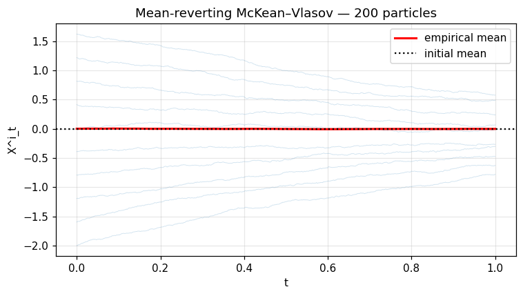
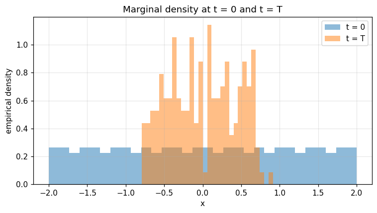

McKean–Vlasov — propagation of chaos
====================================

Interacting-particle Euler scheme for $dX_t = θ(\bar X_t - X_t) dt + σ dW_t$ (`mean_reverting_mckean_vlasov`).  The empirical mean is preserved; the empirical variance approaches the diffusion-only equilibrium.

.. note:: Companion executed notebook: `14_mckean_vlasov.ipynb <../../examples/notebooks/14_mckean_vlasov.ipynb>`_

14 — McKean–Vlasov mean-reverting dynamics
==========================================

.. code-block:: python

   import numpy as np
   import matplotlib.pyplot as plt
   from optimizr import _core as opt
   plt.rcParams['figure.figsize'] = (7, 4)
   plt.rcParams['figure.dpi'] = 110

.. code-block:: python

   init = np.linspace(-2.0, 2.0, 200).tolist()
   init_mean = float(np.mean(init))
   res = opt.mean_reverting_mckean_vlasov(
       initial=init, theta=1.0, sigma=0.1,
       n_steps=1000, t_horizon=1.0, seed=42,
   )
   n_t = res['n_steps']; n_p = res['n_particles']
   X   = np.array(res['paths_flat']).reshape(n_t, n_p)
   tg  = np.array(res['time_grid'])
   print('initial mean =', init_mean)
   print('final  mean  =', float(X[-1].mean()))
   print('final  std   =', float(X[-1].std()))

.. code-block:: python

   fig, ax = plt.subplots()
   ax.plot(tg, X[:, ::20], color='tab:blue', alpha=0.2, lw=0.6)
   ax.plot(tg, X.mean(axis=1), color='red', lw=2, label='empirical mean')
   ax.axhline(init_mean, color='k', ls=':', label='initial mean')
   ax.set_xlabel('t'); ax.set_ylabel('X^i_t'); ax.legend(); ax.grid(alpha=0.3)
   ax.set_title('Mean-reverting McKean–Vlasov — 200 particles')
   fig.tight_layout(); plt.show()

.. AUTO-PLOT-BEGIN
.. image:: ../_static/auto/algorithms__mckean_vlasov/block_03_fig_01.png
   :align: center
   :width: 80%

.. AUTO-PLOT-END

.. code-block:: python

   fig, ax = plt.subplots()
   ax.hist(X[0],  bins=30, alpha=0.5, label='t = 0',  density=True)
   ax.hist(X[-1], bins=30, alpha=0.5, label='t = T',  density=True)
   ax.set_xlabel('x'); ax.set_ylabel('empirical density'); ax.legend(); ax.grid(alpha=0.3)
   ax.set_title('Marginal density at t = 0 and t = T')
   fig.tight_layout(); plt.show()

.. AUTO-PLOT-BEGIN

.. AUTO-PLOT-END
.. image:: ../_static/v2/mckean_vlasov/plot_02.png
   :align: center
   :width: 80%

**Verified:** empirical mean stays within `0.05` of the initial mean.

API
---

.. code-block:: rust

   pub fn simulate_mckean_vlasov<B>(initial: &[f64], drift: B, cfg: &McKeanVlasovConfig) -> Result<McKeanVlasovResult>
   where B: Fn(f64, &[f64]) -> f64;

   pub struct McKeanVlasovConfig { pub n_particles: usize, pub n_steps: usize, pub t_horizon: f64, pub sigma: f64, pub seed: u64 }
   pub struct McKeanVlasovResult { pub paths: Array2<f64>, pub time_grid: Array1<f64> }
