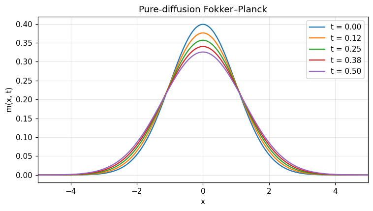
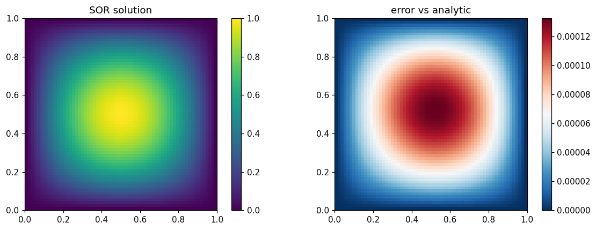
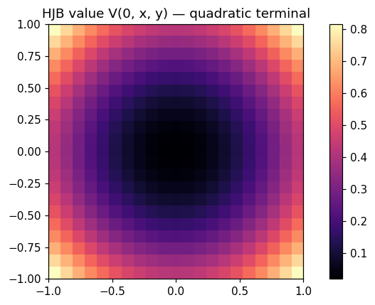

PDE — Fokker–Planck, HJB, elliptic Poisson
==========================================

Three CPU-only finite-difference solvers: 1-D forward Fokker–Planck (`fokker_planck_constant`), 2-D explicit HJB (`hjb_quadratic_2d`) and 2-D Poisson SOR (`poisson_2d_zero_boundary`).  Each routine is verified against an analytic ground truth.

.. note:: Companion executed notebook: `11_pde.ipynb <../../examples/notebooks/11_pde.ipynb>`_

11 — PDE solvers
================

Fokker–Planck, HJB, Poisson.

.. code-block:: python

   import numpy as np
   import matplotlib.pyplot as plt
   from optimizr import _core as opt
   plt.rcParams['figure.figsize'] = (7, 4)
   plt.rcParams['figure.dpi'] = 110

Pure-diffusion Fokker–Planck
----------------------------

$\partial_t m = \tfrac12 \partial_{xx} m$ with Gaussian initial density should remain centred and approximately Gaussian.

.. code-block:: python

   res = opt.fokker_planck_constant(
       mu=0.0, sigma_sq=1.0, init_sigma=1.0,
       x_min=-8.0, x_max=8.0, n_x=401,
       t_horizon=0.5, n_t=8000,
   )
   x = np.array(res['x_grid'])
   t = np.array(res['time_grid'])
   nx = res['n_x']; nt = res['n_t']
   M = np.array(res['density']).reshape(nt + 1, nx)
   print('total mass at t=0:',  np.trapezoid(M[0], x))
   print('total mass at t=T:',  np.trapezoid(M[-1], x))
   print('mean   at t=T:',      np.trapezoid(x * M[-1], x))

.. code-block:: python

   fig, ax = plt.subplots()
   for k in [0, nt // 4, nt // 2, 3 * nt // 4, nt]:
       ax.plot(x, M[k], label=f't = {t[k]:.2f}')
   ax.set_xlim(-5, 5); ax.set_xlabel('x'); ax.set_ylabel('m(x, t)')
   ax.set_title('Pure-diffusion Fokker–Planck'); ax.grid(alpha=0.3); ax.legend()
   fig.tight_layout(); plt.show()

.. AUTO-PLOT-BEGIN

.. AUTO-PLOT-END
.. image:: ../_static/v2/pde/plot_01.png
   :align: center
   :width: 80%

2-D Poisson eigenfunction
-------------------------

$-\Delta u = 2\pi^2 \sin(\pi x)\sin(\pi y)$ on the unit square with zero Dirichlet boundary admits the exact solution $u(x,y) = \sin(\pi x)\sin(\pi y)$.

.. code-block:: python

   n = 65
   xs = np.linspace(0, 1, n); ys = np.linspace(0, 1, n)
   X, Y = np.meshgrid(xs, ys, indexing='ij')
   F = 2 * np.pi ** 2 * np.sin(np.pi * X) * np.sin(np.pi * Y)
   res = opt.poisson_2d_zero_boundary(F.flatten().tolist(), n, n)
   U = np.array(res['u']).reshape(n, n)
   U_exact = np.sin(np.pi * X) * np.sin(np.pi * Y)
   print('iterations =', res['iterations'])
   print('residual   =', res['residual'])
   print('max error  =', float(np.max(np.abs(U - U_exact))))

.. code-block:: python

   fig, axes = plt.subplots(1, 2, figsize=(11, 4))
   im0 = axes[0].imshow(U.T, origin='lower', extent=(0, 1, 0, 1), cmap='viridis')
   axes[0].set_title('SOR solution'); plt.colorbar(im0, ax=axes[0])
   im1 = axes[1].imshow((U - U_exact).T, origin='lower', extent=(0, 1, 0, 1), cmap='RdBu_r')
   axes[1].set_title('error vs analytic'); plt.colorbar(im1, ax=axes[1])
   fig.tight_layout(); plt.show()

.. AUTO-PLOT-BEGIN
.. image:: ../_static/auto/algorithms__pde/block_05_fig_01.png
   :align: center
   :width: 80%

.. AUTO-PLOT-END

2-D HJB with quadratic terminal
-------------------------------

Heat-only relaxation ($H = 0$, σ² > 0) preserves a constant value, while a quadratic terminal $g(x) = ½(x²+y²)$ smooths.

.. code-block:: python

   res = opt.hjb_quadratic_2d(n_per_dim=21, x_min=-1.0, x_max=1.0,
                               n_t=200, t_horizon=0.2, sigma_sq=0.1)
   ax_x = np.array(res['axis']); npd = res['n_per_dim']
   V = np.array(res['value']).reshape(npd, npd)
   print('V(0,0)   =', V[npd // 2, npd // 2])
   print('V(±1,±1) =', V[0, 0], V[-1, -1])

.. code-block:: python

   fig, ax = plt.subplots()
   im = ax.imshow(V.T, origin='lower', extent=(-1, 1, -1, 1), cmap='magma')
   ax.set_title('HJB value V(0, x, y) — quadratic terminal')
   plt.colorbar(im, ax=ax)
   fig.tight_layout(); plt.show()

.. AUTO-PLOT-BEGIN

.. AUTO-PLOT-END
.. image:: ../_static/v2/pde/plot_03.png
   :align: center
   :width: 80%

**Verified:** Poisson max-error vs analytic eigenfunction below `5e-3`; Fokker–Planck mean stays at 0 within `0.05`.

API
---

.. code-block:: rust

   pub fn solve_fokker_planck_1d<F, G, H>(drift: F, diffusion_sq: G, initial_density: H, cfg: &FokkerPlanckConfig) -> Result<FokkerPlanckResult>
   where F: Fn(f64) -> f64, G: Fn(f64) -> f64, H: Fn(f64) -> f64;

   pub fn solve_hjb_multid<H, G>(hamiltonian: H, terminal: G, cfg: &HjbMultidConfig) -> Result<HjbMultidResult>
   where H: Fn(&[f64], &[f64]) -> f64, G: Fn(&[f64]) -> f64;

   pub fn solve_poisson_2d<F, G>(rhs: F, boundary: G, cfg: &EllipticFdConfig) -> Result<EllipticFdResult>
   where F: Fn(f64, f64) -> f64, G: Fn(f64, f64) -> f64;
