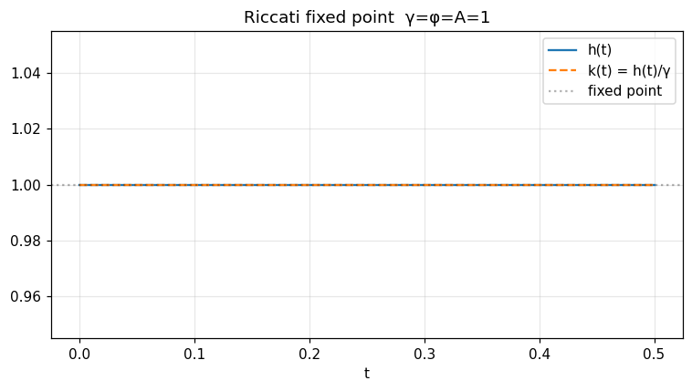
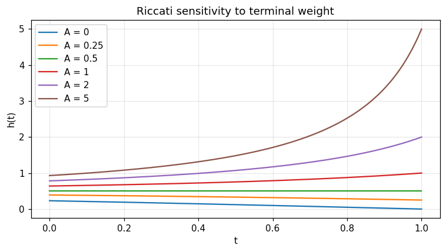

Quadratic-impact control — closed-form Riccati
==============================================

Closed-form Riccati feedback for a controlled 1-D SDE with quadratic running cost (`quadratic_impact_control_py`).

.. note:: Companion executed notebook: `13_quadratic_impact.ipynb <../../examples/notebooks/13_quadratic_impact.ipynb>`_

13 — Quadratic-impact controlled SDE
====================================

.. code-block:: python

   import numpy as np
   import matplotlib.pyplot as plt
   from optimizr import _core as opt
   plt.rcParams['figure.figsize'] = (7, 4)
   plt.rcParams['figure.dpi'] = 110

Riccati fixed-point check
-------------------------

$h'(t) = h(t)^2/γ - φ$ with $h(T) = A$.  When $γ = φ = A = 1$ the right-hand side is $h^2 - 1 = 0$ at $h = 1$, so `h ≡ 1`.

.. code-block:: python

   res = opt.quadratic_impact_control_py(
       gamma=1.0, phi=1.0, a_terminal=1.0,
       t_horizon=0.5, n_steps=500,
   )
   tg = np.array(res['time_grid'])
   h  = np.array(res['h']); k = np.array(res['feedback_gain'])
   print('h drift from 1:', float(np.max(np.abs(h - 1.0))))

.. code-block:: python

   fig, ax = plt.subplots()
   ax.plot(tg, h, label='h(t)')
   ax.plot(tg, k, '--', label='k(t) = h(t)/γ')
   ax.axhline(1.0, color='k', alpha=0.3, ls=':', label='fixed point')
   ax.set_xlabel('t'); ax.legend(); ax.grid(alpha=0.3)
   ax.set_title('Riccati fixed point  γ=φ=A=1')
   fig.tight_layout(); plt.show()

.. AUTO-PLOT-BEGIN

.. AUTO-PLOT-END
.. image:: ../_static/v2/quadratic_impact_control/plot_01.png
   :align: center
   :width: 80%

Sensitivity to the terminal weight
----------------------------------

Vary $A$, fix $γ = 1$, $φ = 0.25$, $T = 1$.

.. code-block:: python

   fig, ax = plt.subplots()
   for A in [0.0, 0.25, 0.5, 1.0, 2.0, 5.0]:
       r = opt.quadratic_impact_control_py(1.0, 0.25, A, 1.0, 1000)
       ax.plot(r['time_grid'], r['h'], label=f'A = {A:g}')
   ax.set_xlabel('t'); ax.set_ylabel('h(t)'); ax.legend(); ax.grid(alpha=0.3)
   ax.set_title('Riccati sensitivity to terminal weight')
   fig.tight_layout(); plt.show()

.. AUTO-PLOT-BEGIN

.. AUTO-PLOT-END
.. image:: ../_static/v2/quadratic_impact_control/plot_02.png
   :align: center
   :width: 80%

**Verified:** `h ≡ 1` with `max|h - 1| < 1e-9` at the fixed point.

API
---

.. code-block:: rust

   pub fn solve_quadratic_impact_control(cfg: &QuadraticImpactConfig) -> Result<QuadraticImpactResult>;
   pub struct QuadraticImpactConfig { pub gamma: f64, pub phi: f64, pub a_terminal: f64, pub t_horizon: f64, pub n_steps: usize }
   pub struct QuadraticImpactResult { pub time_grid: Array1<f64>, pub h: Array1<f64>, pub feedback_gain: Array1<f64> }
