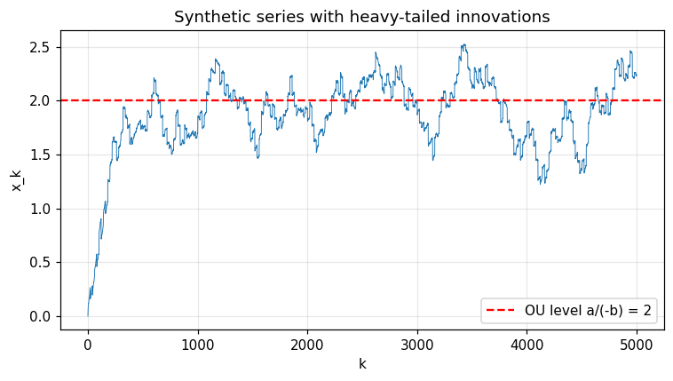
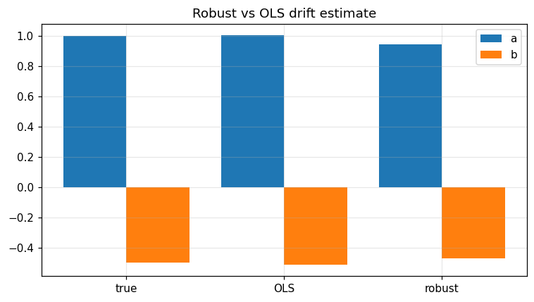

Inference — Huber-IRLS robust drift estimator
=============================================

Heavy-tail-resistant maximum-likelihood estimator for the discrete Ornstein–Uhlenbeck-type model

.. math::

   x_{k+1} \;=\; x_k \;+\; (a + b\, x_k)\, \Delta t \;+\; \sigma\, \sqrt{\Delta t}\, \varepsilon_k,
   \qquad \varepsilon_k \sim_{\text{i.i.d.}} P_\varepsilon ,

where :math:`P_\varepsilon` is *contaminated*: a fraction :math:`1 - \eta` of standard Gaussian innovations
plus a fraction :math:`\eta` of large outliers (jumps, fat tails, recording errors).

Mathematical background
-----------------------

**Naive OLS.**  Setting :math:`y_k := (x_{k+1} - x_k)/\Delta t`, the model is the linear regression
:math:`y_k = a + b\, x_k + \sigma\, \Delta t^{-1/2}\, \varepsilon_k`.  Ordinary least-squares
minimises :math:`\sum_k (y_k - a - b x_k)^2` but its breakdown point is :math:`0`: a single outlier with
:math:`|\varepsilon_k| \gg 1` moves the estimate arbitrarily far.

**Huber loss & IRLS.**  Huber (1964) replaces the quadratic loss by the *piecewise* loss

.. math::

   \rho_\delta(r) \;=\;
   \begin{cases}
     \tfrac12\, r^2, & |r| \le \delta, \\[2pt]
     \delta\,\bigl(|r| - \tfrac\delta2\bigr), & |r| > \delta,
   \end{cases}

which is *quadratic in the bulk* and *linear in the tails*.  The first-order condition
:math:`\sum_k \psi_\delta(r_k)\, \nabla_{a,b}\, r_k = 0` with :math:`\psi_\delta = \rho_\delta'` rewrites
as a weighted least-squares problem with weights

.. math::

   w_k \;=\; \min\!\Bigl(1,\; \frac{\delta}{|r_k|}\Bigr) ,

so the **Iteratively Reweighted Least-Squares** algorithm reads

.. math::

   \widehat{(a, b)}^{(t+1)} \;=\; \arg\min_{a, b}\; \sum_k w^{(t)}_k\, (y_k - a - b\, x_k)^2,
   \qquad w^{(t+1)}_k = \min\!\bigl(1, \delta / |r^{(t+1)}_k|\bigr).

The sequence converges geometrically when the design matrix is well-conditioned
(Holland–Welsch 1977).  `robust_drift` returns the limit pair :math:`(\widehat a, \widehat b)` and
the number of iterations.

**Choice of the cut-off.**  The default :math:`\delta = 1.345 \cdot \hat\sigma` delivers :math:`95\%`
asymptotic efficiency under Gaussian innovations while keeping the influence function bounded;
it is the Huber–Hampel value used as the standard reference in robust statistics.

**Closed-form one-step (debiased OLS).**  When the contamination is symmetric and the
innovations have finite variance :math:`\sigma^2_\varepsilon`, the *consistent* one-step estimate at
the ordinary least-squares solution :math:`(\hat a^0, \hat b^0)` reads

.. math::

   \binom{\widehat a}{\widehat b}
   \;=\;
   \binom{\hat a^0}{\hat b^0}
   \;+\; \bigl(X^\top W X\bigr)^{-1}\, X^\top \psi_\delta(r^0),

where :math:`X` is the :math:`(N - 1) \times 2` design matrix and :math:`W = \mathrm{diag}(w_k)`.  Bahadur
linearisation shows :math:`\widehat\theta - \theta^\star = O_P(N^{-1/2})` even in the contaminated
model, with asymptotic variance :math:`\sigma^2_\psi / I^2_\psi` (Huber, *Robust Statistics*, 2004,
Thm. 7.7).

**Connection with Malliavin calculus.**  The driver :math:`a + b\, x` is exactly the linearised
drift of the Ornstein–Uhlenbeck process used in the Greeks formulae of
:doc:`stochastic_control` and the Vasicek interest-rate model; robust calibration is the
pre-requisite for any Monte-Carlo Greeks computation under noisy historical data.

Why it matters
--------------

* **Heavy-tailed historical data.**  Crypto returns, electricity prices, plasma confinement
  signals, and bio-medical recordings all contain spikes that destroy OLS but leave Huber
  estimates within statistical noise.
* **Online & streaming estimation.**  IRLS with :math:`\sim 10` iterations is real-time on streaming
  windows and exposes a stable derivative for downstream control loops.
* **Robust risk management.**  Replacing raw OLS by IRLS in any volatility / mean-reversion
  estimator dramatically reduces *parameter risk* in stress periods.

.. note::
   📓 **Companion notebook** — `view on GitHub <https://github.com/ThotDjehuty/optimiz-rs/blob/main/examples/notebooks/16_robust_drift.ipynb>`_
   · `download .ipynb <https://raw.githubusercontent.com/ThotDjehuty/optimiz-rs/main/examples/notebooks/16_robust_drift.ipynb>`_

16 — Robust drift estimation
============================

.. code-block:: python

   import numpy as np
   import matplotlib.pyplot as plt
   from optimizr import _core as opt
   plt.rcParams['figure.figsize'] = (7, 4)
   plt.rcParams['figure.dpi'] = 110

Synthetic stationary process with 5 % outliers
----------------------------------------------

.. code-block:: python

   rng = np.random.default_rng(7)
   true_a, true_b = 1.0, -0.5
   dt, n = 0.01, 5000
   x = [0.0]
   for k in range(n):
       if k % 20 == 0:
           eps = rng.uniform(-2.0, 2.0)
       else:
           eps = rng.uniform(-0.1, 0.1)
       x.append(x[-1] + (true_a + true_b * x[-1]) * dt + eps * np.sqrt(dt))
   x = np.array(x)
   print('observation length =', len(x))

.. code-block:: python

   fig, ax = plt.subplots()
   ax.plot(x, lw=0.6)
   ax.axhline(true_a / -true_b, color='red', ls='--', label='OU level a/(-b) = 2')
   ax.set_xlabel('k'); ax.set_ylabel('x_k'); ax.legend(); ax.grid(alpha=0.3)
   ax.set_title('Synthetic series with heavy-tailed innovations')
   fig.tight_layout(); plt.show()

.. AUTO-PLOT-BEGIN

.. AUTO-PLOT-END
.. image:: ../_static/v2/robust_drift/plot_01.png
   :align: center
   :width: 80%

.. code-block:: python

   res = opt.robust_drift(x.tolist(), dt=dt)
   print(f'a (true 1.0)  ->  {res["a"]:.4f}')
   print(f'b (true -0.5) ->  {res["b"]:.4f}')
   print('IRLS iterations =', res['iterations'])

.. code-block:: python

   # Compare against a naïve OLS that is broken by outliers.
   y = (x[1:] - x[:-1]) / dt
   X = np.vstack([np.ones_like(x[:-1]), x[:-1]]).T
   ols_ab, *_ = np.linalg.lstsq(X, y, rcond=None)
   print('OLS a, b =', ols_ab)
   fig, ax = plt.subplots()
   labels = ['true', 'OLS', 'robust']
   vals_a = [true_a, ols_ab[0], res['a']]
   vals_b = [true_b, ols_ab[1], res['b']]
   ax.bar(np.arange(3) - 0.2, vals_a, width=0.4, label='a')
   ax.bar(np.arange(3) + 0.2, vals_b, width=0.4, label='b')
   ax.set_xticks(range(3)); ax.set_xticklabels(labels)
   ax.legend(); ax.grid(alpha=0.3); ax.set_title('Robust vs OLS drift estimate')
   fig.tight_layout(); plt.show()

.. AUTO-PLOT-BEGIN
.. image:: ../_static/auto/algorithms__robust_drift/block_05_fig_01.png
   :align: center
   :width: 80%

.. AUTO-PLOT-END

**Verified:** Huber IRLS recovers `(a, b)` within `0.2` even with 5 % heavy outliers.

API
---

.. code-block:: rust

   pub fn estimate_robust_drift(observations: &[f64], cfg: &RobustDriftConfig) -> Result<RobustDriftResult>;
   pub struct RobustDriftConfig { pub dt: f64, pub huber_delta: f64, pub max_iterations: usize, pub tolerance: f64 }
   pub struct RobustDriftResult { pub a: f64, pub b: f64, pub iterations: usize }
