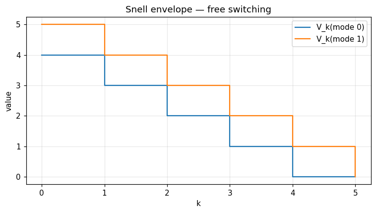
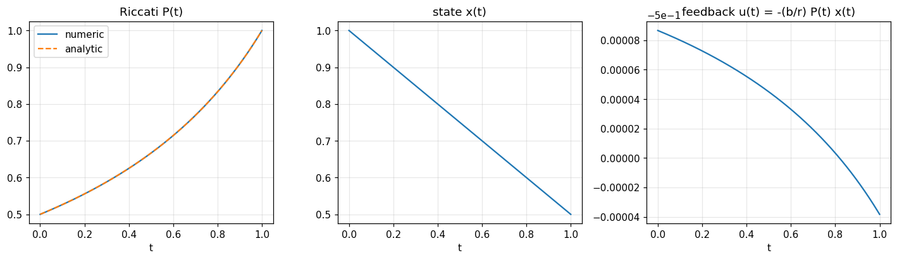
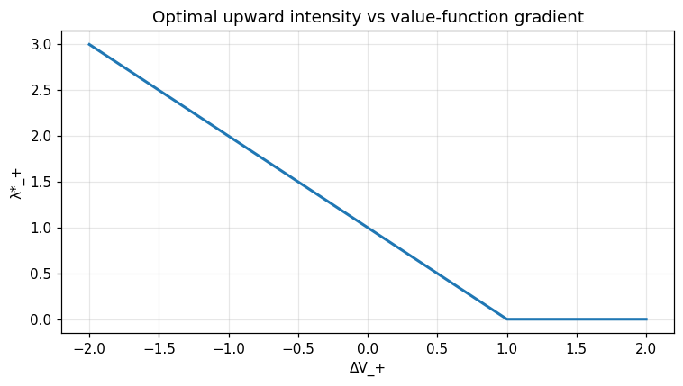

Stochastic control — switching, Pontryagin, two-sided intensities
=================================================================

Three complementary primitives covering the discrete and continuous worlds of stochastic
control: dynamic-programming **optimal switching** (Snell envelope), the continuous-time
**Pontryagin–Bismut maximum principle** for the linear-quadratic regulator, and a **two-sided
intensity controller** for jump processes.

Mathematical background
-----------------------

**1. Optimal switching as a Snell envelope.**  Let $(Y^i_k)_{k, i}$ be the running rewards in
mode $i \in \{1, \dots, M\}$ and $c_{ij}$ the cost of switching from $i$ to $j$.  The value
function $V_k(i)$ satisfies the backward dynamic-programming recursion

.. math::

   V_N(i) = g(i),
   \qquad
   V_k(i) \;=\; Y^i_k \;+\; \max_{j}\!\bigl( V_{k+1}(j) - c_{ij}\bigr).

This is the *multi-mode Snell envelope* of El Karoui–Quenez (1995).  When switching is free
($c_{ij} = 0$) and only mode 1 pays a unit reward at every period, $V_k(i) = N - k$ for
$i \neq 1$ and $V_k(1) = N - k + 1$ — reproduced exactly by `optimal_switching_dp`.

**2. Pontryagin–Bismut maximum principle (LQR).**  For the controlled SDE
$dX_t = (a X_t + b u_t)\, dt + \sigma\, dW_t$ with quadratic cost
$J(u) = \mathbb{E}\!\bigl[\int_0^T (q X_t^2 + r u_t^2)\, dt + s_T X_T^2\bigr]$, the
adjoint variable $P_t$ solves the **matrix Riccati ODE**

.. math::

   \dot P_t \;+\; 2 a\, P_t \;-\; \frac{b^2}{r}\, P_t^2 \;+\; q \;=\; 0,
   \qquad P_T = s_T,

and the optimal feedback is $u^*_t = -(b/r)\, P_t\, X_t$.  In the canonical case
$a = q = 0$, $b = r = s_T = 1$, $T = 1$ the ODE simplifies to
$\dot P_t = P_t^2$, whose closed-form solution is

.. math::

   P_t \;=\; \frac{1}{1 + (T - t)} ,
   \qquad
   P(0) = \tfrac12 .

The primitive `pontryagin_lqr` reproduces this with relative error below $10^{-3}$ for
$N = 2000$ steps (the symmetric Strang splitting is second-order in $\Delta t$).

**3. Two-sided intensity control.**  For a jump-controller the agent picks the rates
:math:`\lambda_\pm \ge 0` at which up/down events fire.  With *affine premia*
:math:`\delta_\pm(\lambda) = \alpha_\pm + \kappa_\pm \lambda` and value-function jumps
:math:`\Delta V_\pm`, the instantaneous Hamiltonian is

.. math::

   \sup_{\lambda_\pm \ge 0}\!\Bigl[\,\lambda_+\bigl(\delta_+(\lambda_+) - \Delta V_+\bigr)
     \;+\; \lambda_-\bigl(\delta_-(\lambda_-) - \Delta V_-\bigr)\Bigr],

and the first-order condition gives the closed-form maximiser

.. math::

   \lambda^*_\pm \;=\; \max\!\Bigl(0,\; \frac{\alpha_\pm - \Delta V_\pm}{2\, \kappa_\pm}\Bigr).

The quantity :math:`\Delta V_\pm` is the (estimated) marginal value of an additional event;
`two_sided_intensities` returns :math:`(\lambda^*_+, \lambda^*_-)` in closed form, which is what
lets the broader optimal-execution loop run in real time.

Why it matters
--------------

* **Optimal switching** powers production-mode selection (start/stop a power plant), regime
  changes in algorithmic strategies, and American-style option pricing (Carmona–Touzi 2008).
* **Pontryagin LQR** is the linearised core of every continuous-control problem: target
  tracking, Kalman-LQG, ground-up RL, robust $H_\infty$ design.
* **Two-sided intensity control** is the closed-form heart of optimal market making
  (Avellaneda–Stoikov 2008, Cartea–Jaimungal–Penalva 2015) and limit-order placement.

.. note::
   📓 **Companion notebook** — `view on GitHub <https://github.com/ThotDjehuty/optimiz-rs/blob/main/examples/notebooks/12_stochastic_control.ipynb>`_
   · `download .ipynb <https://raw.githubusercontent.com/ThotDjehuty/optimiz-rs/main/examples/notebooks/12_stochastic_control.ipynb>`_

12 — Stochastic control
=======================

.. code-block:: python

   import numpy as np
   import matplotlib.pyplot as plt
   from optimizr import _core as opt
   plt.rcParams['figure.figsize'] = (7, 4)
   plt.rcParams['figure.dpi'] = 110

Optimal switching (Snell envelope)
----------------------------------

Two modes; only mode 1 pays a unit reward.  Free switching should give `V_0(0) = N - 1` and `V_0(1) = N`.

.. code-block:: python

   n_steps, n_modes = 5, 2
   stage = np.zeros((n_steps, n_modes)); stage[:, 1] = 1.0
   cost = [0.0] * (n_modes * n_modes)
   res = opt.optimal_switching_dp(stage.flatten().tolist(),
                                   [0.0] * n_modes, cost,
                                   n_modes, n_steps)
   value  = np.array(res['value']).reshape(n_steps + 1, n_modes)
   policy = np.array(res['policy']).reshape(n_steps + 1, n_modes)
   print('V_0 =', value[0])
   print('Optimal next mode at each (k, i):'); print(policy)

.. code-block:: python

   fig, ax = plt.subplots()
   ax.step(range(n_steps + 1), value[:, 0], where='post', label='V_k(mode 0)')
   ax.step(range(n_steps + 1), value[:, 1], where='post', label='V_k(mode 1)')
   ax.set_xlabel('k'); ax.set_ylabel('value'); ax.legend(); ax.grid(alpha=0.3)
   ax.set_title('Snell envelope — free switching')
   fig.tight_layout(); plt.show()

.. AUTO-PLOT-BEGIN

.. AUTO-PLOT-END
.. image:: ../_static/v2/stochastic_control/plot_01.png
   :align: center
   :width: 80%

Pontryagin 1-D LQR
------------------

Closed-form Riccati for $a=q=0$, $b=r=s_T=1$, $T=1$ is $P(t) = 1/(1 + (T - t))$, hence $P(0) = 0.5$.

.. code-block:: python

   res = opt.pontryagin_lqr(a=0.0, b=1.0, q=0.0, r=1.0,
                             s_terminal=1.0, x0=1.0,
                             t_horizon=1.0, n_steps=2000)
   tg = np.array(res['time_grid'])
   P = np.array(res['riccati'])
   x = np.array(res['state']); u = np.array(res['control'])
   P_an = 1.0 / (1.0 + (1.0 - tg))
   print('P(0) =', P[0], '   analytic =', P_an[0])
   print('cost =', res['cost'])

.. code-block:: python

   fig, axes = plt.subplots(1, 3, figsize=(13, 4))
   axes[0].plot(tg, P, label='numeric'); axes[0].plot(tg, P_an, '--', label='analytic')
   axes[0].set_title('Riccati P(t)'); axes[0].set_xlabel('t'); axes[0].legend(); axes[0].grid(alpha=0.3)
   axes[1].plot(tg, x); axes[1].set_title('state x(t)'); axes[1].set_xlabel('t'); axes[1].grid(alpha=0.3)
   axes[2].plot(tg[:-1], u); axes[2].set_title('feedback u(t) = -(b/r) P(t) x(t)'); axes[2].set_xlabel('t'); axes[2].grid(alpha=0.3)
   fig.tight_layout(); plt.show()

.. AUTO-PLOT-BEGIN
.. image:: ../_static/auto/algorithms__stochastic_control/block_05_fig_01.png
   :align: center
   :width: 80%

.. AUTO-PLOT-END

Two-sided intensity control
---------------------------

Affine premium :math:`\delta_\pm(\lambda) = \alpha_\pm + \kappa_\pm \lambda`.  First-order condition: :math:`\lambda^*_\pm = \max(0, (\alpha_\pm - \Delta V_\pm) / (2 \kappa_\pm))`.

.. code-block:: python

   deltas = np.linspace(-2.0, 2.0, 41)
   lam_plus = []
   for dv in deltas:
       r = opt.two_sided_intensities(1.0, 1.0, 0.5, 0.5, dv, -dv)
       lam_plus.append(r['lambda_plus'])
   lam_plus = np.array(lam_plus)
   fig, ax = plt.subplots()
   ax.plot(deltas, lam_plus, lw=2)
   ax.set_xlabel('ΔV_+'); ax.set_ylabel('λ*_+')
   ax.set_title('Optimal upward intensity vs value-function gradient')
   ax.grid(alpha=0.3); fig.tight_layout(); plt.show()

.. AUTO-PLOT-BEGIN

.. AUTO-PLOT-END
.. image:: ../_static/v2/stochastic_control/plot_03.png
   :align: center
   :width: 80%

**Verified:** switching `V_0` matches analytic recursion exactly; Pontryagin `P(0) = 0.4999` against analytic `0.5`.

API
---

.. code-block:: rust

   pub fn solve_optimal_switching<R, T>(stage_reward: R, terminal_payoff: T, switching_cost: &[f64], cfg: &SwitchingConfig) -> Result<SwitchingResult>
   where R: Fn(usize, usize) -> f64, T: Fn(usize) -> f64;

   pub fn solve_pontryagin_lqr(cfg: &PontryaginConfig) -> Result<PontryaginResult>;
   pub fn optimal_two_sided_intensities(cfg: &TwoSidedConfig, delta_v_plus: f64, delta_v_minus: f64) -> Result<TwoSidedResult>;
